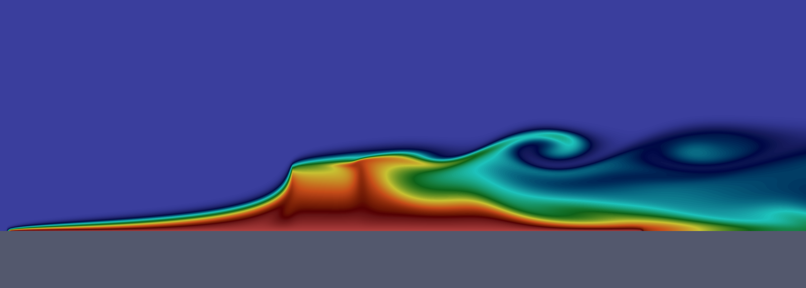

<h1 align="center">
  Ixchel2D
   
   
  

    
  

</h1>

<!--    -->
  

<h5 align="center">
  Software de Simulación Numérica Ixchel2D
</h5>

  
  
  
  

Requerimentos
-------------

Instalación
-----------

Compilación
-----------

Ejecución de Casos de Prueba
----------------------------

Eliminar la aplicación
----------------------
