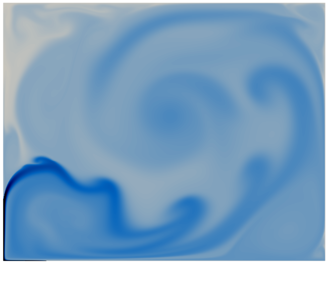

<h1 align="center">
  Ixchel2D
  <br/>
  <br/>
  <div>
    
    
  </div>
</h1>
<!-- <div align="center">
    
    
</div> -->
<h5 align="center">
  Software de Simulación Numérica Ixchel2D
</h5>

<div align="center">
  
  
  
  
</div>

✅ Requerimentos
-------------
- Un compilador de Fortran: se recomienda `gfortran`.
- El compilador `nvfortran` de NVIDIA HPC SDK.
- Paraview.
- cmake >= 3.22
- git

💾 Instalación
-----------
Para instalar Ixchel2D ejecute los siguientes comandos:
```shell
git clone https://github.com/ENES-Merida/Ixchel2D.git /ruta/a/Ixchel2D
rm -rf /opt/Ixchel2D/.git
```
> ⚠️ Reemplace `/ruta/a/` con la ruta al directorio donde desea almacenar el programa en su sistema (por ejemplo, `$HOME/programas/`).

📦 Compilación
-----------
Siga los siguientes pasos para compilar el programa de Ixchel2D:
```shell
cd /ruta/a/Ixchel2D
mkdir build && cd build
```

Si desea ejecutar Ixchel2D con multicore:
```shell
cmake ../source/ -DENABLE_GPU=OFF
make
```

Si cuenta con una Unidad Gráfica de Procesamiento (GPU por sus siglas en Inglés) y desea ejecutar Ixchel2D con ella, primero ejecute lo siguiente para conocer la capacidad de cómputo de la GPU:
```shell
nvaccelinfo | grep "Default Target"
```
El comando anterior debe dar un respuesta como la siguiente:
```shell
Default Target:                ccXX
```
El valor `ccXX` es la capacidad de cómputo de la GPU.

Sabiendo la capacidad de cómputo de la GPU, ahora ejecutamos lo siguiente:
```shell
cmake ../source/ -DENABLE_GPU=ON -DCOMPUTE_CAPABILITY=ccXX
make
```

⚙️ Ejecución de Casos de Prueba
----------------------------
Para validar que Ixchel2D funciona correctamente, ejecute alguno de los siguiente caso de prueba:

🧑‍💻 Uso de Ixchel2D
---------------

En Ixchel2D el usuario interactúa con cuatro directorios principales:
- `source`: en este se almacena el código fuente de Ixchel2D.
- `build`: siguiendo las buenas prácticas de `cmake` se crea este directorio en donde se compila el código fuente y se genera el ejecutable (multicore o gpu) para ejecutar Ixchel2D.
- `malla`: aquí se compila y se crea el ejecutable que genera la malla. Además se generan los archivos de salida que determinan la estructura de la malla; estos deben moverse a la carpeta del caso que le corresponde.
- `casos`:
  - se recomienda crear este directorio para almacenar cada caso particular. Dentro de cada caso se definen los parámetros de flujo y las condiciones de frontera.
  - En el archivo `parametros.dat` se puede determinar si la convección es:
    - *Mixta*: los 1er y 2do parámetros son números de Reynolds.
    - *Natural*: el 1er parámetro es el número de Rayleigh y el Richardson se ignora.
  - Es fundamental que se trasladen los archivos de salida de malla a la carpeta del caso correspondiente.
  - El ejecutable de Ixchel leerá las condiciones de frontera, parámetros de flujo y malla en la carpeta del caso.
  - Se debe crear un folder dentro de cada caso donde se almacenen los resultados a lo largo del tiempo. Dicho folder será abierto por Paraview para ver un resultado gráfico.

❌ Eliminar la aplicación
----------------------
Para eliminar el programa Ixchel2D ejecute lo siguiente:
```shell
rm -rf /ruta/a/Ixchel2D
```
